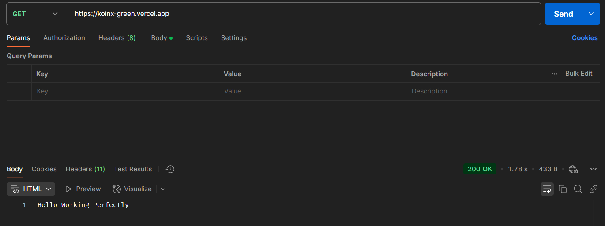
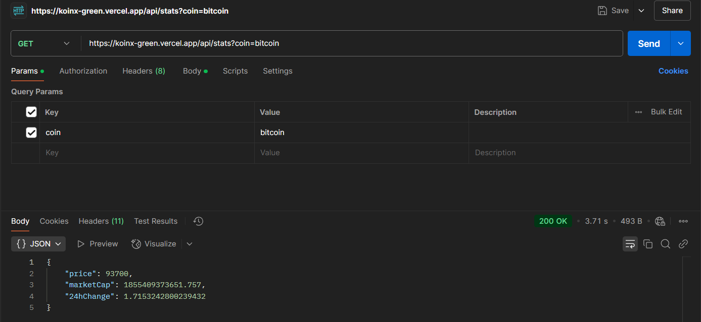
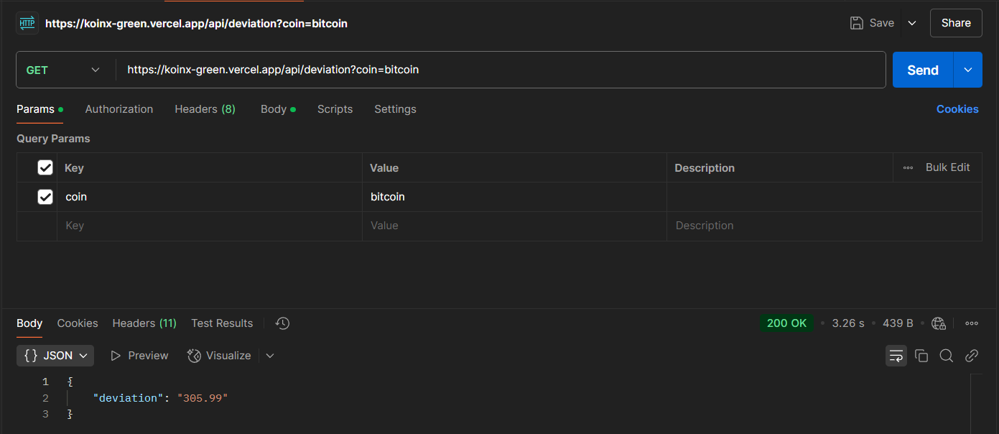

# Crypto Server Application

This is a Node.js backend application that fetches cryptocurrency data using the CoinGecko API and provides endpoints to retrieve stats and calculate the standard deviation of prices.

## Features

- Fetch cryptocurrency stats (price, market cap, and 24-hour change) for Bitcoin, Ethereum, and Matic every 2 hours.
- Store the fetched data in MongoDB.
- Provide APIs for:
  - Retrieving the latest stats for a cryptocurrency.
  - Calculating the standard deviation of the price for the last 100 records.

---

## Project Structure

```plaintext
crypto_server_app/
│
├── config/
│   └── db.js                # MongoDB connection configuration
├── controllers/
│   ├── statsController.js   # Logic for retrieving cryptocurrency stats
│   └── deviationController.js # Logic for calculating standard deviation
├── routes/
│   └── apiRoutes.js         # API routes definitions
├── models/
│   └── cryptoData.js        # Mongoose schema for storing cryptocurrency data
├── jobs/
│   └── fetchCryptoData.js   # Background job to fetch cryptocurrency data
├── .env                     # Environment variables (e.g., MONGO_URI, PORT)
├── server.js                # Main entry point of the application
├── resource/                # Images for documentation
│   ├── get.jpg              # Home route example image
│   ├── api1.jpg             # Coin stats API example image
│   └── api2.jpg             # Deviation API example image
└── package.json             # Project metadata and dependencies
```

---

## Installation and Setup

### 1. Clone the Repository

Run the following commands to clone the repository and navigate into the project directory:

```bash
git clone https://github.com/<your-username>/<your-repository>.git
cd crypto_server_app
```

---

### 2. Install Dependencies

Install the required packages using:

```bash
npm install
```

---

### 3. Set Up Environment Variables

Create a `.env` file in the root directory and add the following:

```env
MONGO_URI=mongodb://localhost:27017/cryptoApp
PORT=5000
```

Replace the values of `MONGO_URI` and `PORT` with your specific configuration if necessary.

---

### 4. Run the Application

To start the application, use one of the following commands:

#### For development (with auto-reload using Nodemon):
```bash
npm run dev
```

#### For production:
```bash
npm start
```

---

## APIs

### 1. `/`

This is the home route for the application.

#### Example Response:
The root route simply displays a default message or homepage. Below is an example output:



---

### 2. `/api/stats`

Retrieve the latest stats for a cryptocurrency.

- **Method:** `GET`
- **Query Parameters:**
  - `coin`: The cryptocurrency ID (e.g., `bitcoin`, `ethereum`, `matic-network`).

#### Sample Request:
```bash
curl "http://localhost:5000/api/stats?coin=bitcoin"
```

#### Sample Response:
```json
{
  "price": 40000,
  "marketCap": 800000000,
  "24hChange": 3.4
}
```

#### Example Response Image:


---

### 3. `/api/deviation`

Calculate the standard deviation of the price for the last 100 records of a cryptocurrency.

- **Method:** `GET`
- **Query Parameters:**
  - `coin`: The cryptocurrency ID (e.g., `bitcoin`, `ethereum`, `matic-network`).

#### Sample Request:
```bash
curl "http://localhost:5000/api/deviation?coin=bitcoin"
```

#### Sample Response:
```json
{
  "deviation": 4082.48
}
```

#### Example Response Image:


---

## Background Job

The application includes a background job that runs every 2 hours to fetch the following details for Bitcoin, Ethereum, and Matic:
- Current price in USD.
- Market capitalization in USD.
- 24-hour price change percentage.

This data is fetched using the [CoinGecko API](https://www.coingecko.com/en/api/documentation) and stored in MongoDB.

---

## Scripts

- **Start the server:** `npm start`
- **Run the server with Nodemon:** `npm run dev`

---

## Technologies Used

- **Node.js**: Backend runtime.
- **Express.js**: Web framework for API creation.
- **MongoDB**: Database for storing cryptocurrency data.
- **Mongoose**: ODM library for MongoDB.
- **Axios**: HTTP client for making API requests.
- **Dotenv**: For managing environment variables.

---

## Future Enhancements

- Add more cryptocurrencies for tracking.
- Implement authentication for API endpoints.
- Add user-specific data tracking and notifications.

---

## License

This project is licensed under the MIT License. See the LICENSE file for details.
```
